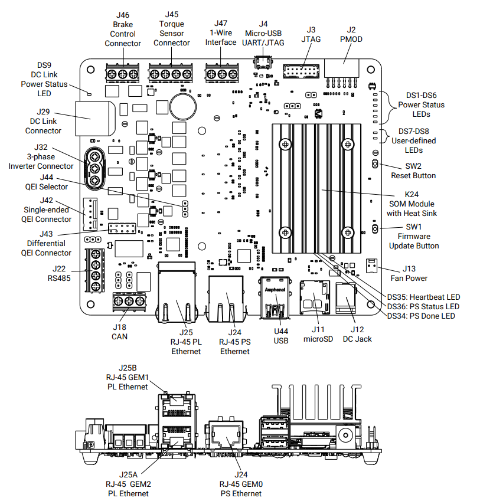
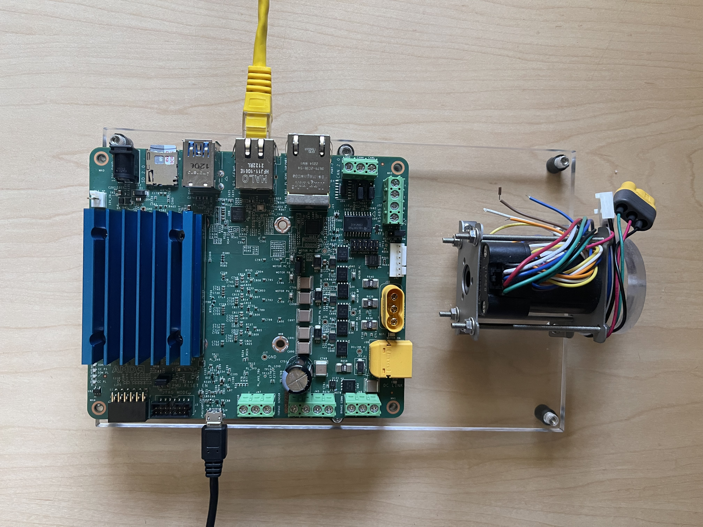
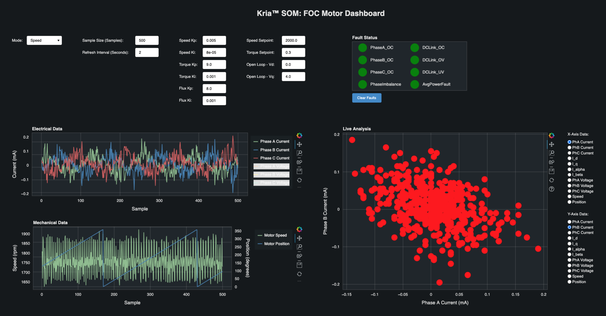
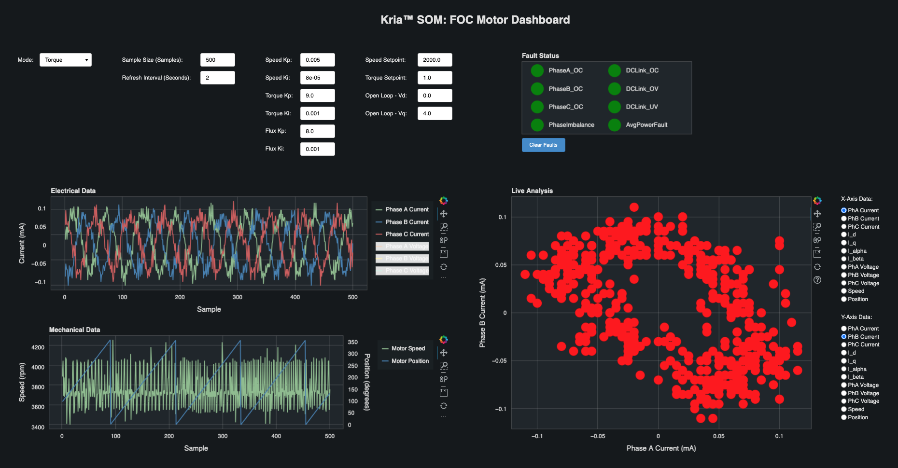
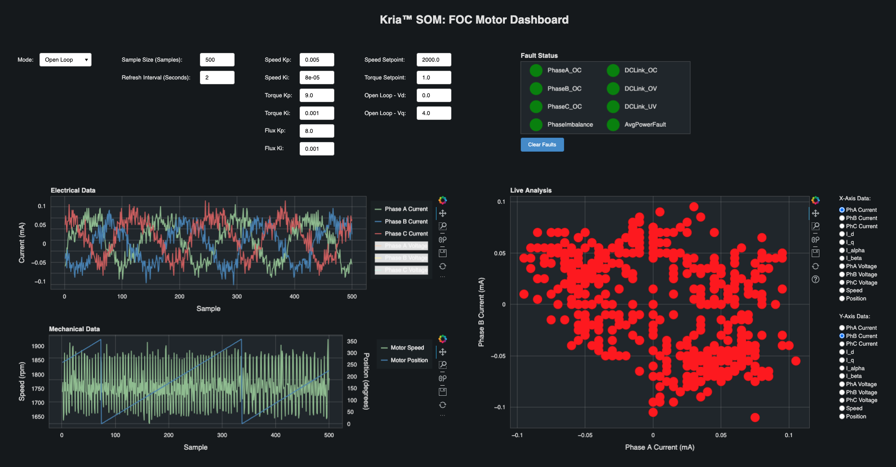

<table class="sphinxhide">
 <tr>
   <td align="center"><h1> Kria&trade; KD240 Drives Starter Kit <br>FOC Motor Control Application Tutorial</h1>
   </td>
 </tr>
 <tr>
 <td align="center"><h1>Setting up the Board and Application Deployment</h1>

 </td>
 </tr>
</table>

# Board Setup and Application Deployment

## Introduction

This document shows how to set up the board and run the motor control
application.

This guide is targeted for Ubuntu® 22.04 and AMD 2023.1 toolchain.

## Pre-requisite

### Hardware Requirements

* [KD240 Drives Starter Kit](https://www.xilinx.com/products/som/kria/kd240-drives-starter-kit.html)

* [KD240 Motor Accessory Kit](https://www.xilinx.com/products/som/kria/kd240-motor-accessory-pack.html)

* KD240 Power Supply & Adapter (Included with KD240 Drives Starter Kit)
    * 12V AC Adapter for KD240 Starter Kit and 24V AC Adapter for Motor
      Accessory Kit

* USB-A to micro-B Cable (Included with KD240 Drives Starter Kit)

* MicroSD Card (32GB card is included with KD240 Drives Starter Kit)

* CAT6 Ethernet Cable

* Host Machine with Display

### Hardware Setup



* Connect USB cable from host machine to J4 UART/JTAG interface on the board


* Connect the Ethernet cable from J24 to your local network with DHCP enabled to install Linux packages.



* Connect 12V power supply to J12 DC jack


* Connect 24V power supply to J29 DC link connector


* Connect encoder header pins to J42 QEI connector. Ensure J44 is in the "SE" selection.


* Connect motor input to J32 3-phase inverter connector


### Initial Setup

1. Testing was performed with:

   |   Components  |       Version          |
   | :-----------: | :-------------------:  |
   |  Linux Kernel |  5.15.0-9002           |
   | Boot Firmware | k24-smk-20230912123632 |
   |  Linux Image  | kd03-1-20230911-132    |
   |   Board       |   KD240                |

   Please refer [Kria Wiki](https://xilinx-wiki.atlassian.net/wiki/spaces/A/pages/1641152513/Kria+K26+SOM#Boot-Firmware-Updates)
   to obtain latest linux image and boot firmware

2. Go through [Booting Kria Starter Kit Linux](https://xilinx.github.io/kria-apps-docs/kd240/linux_boot.html)
   to complete the minimum setup required to boot Linux before continuing with instructions in this page.

3. Get the latest motor control application and firmware package:

   * Download the firmware
      * Search package feed for packages compatible with KD240

         ```bash
         ubuntu@kria:~$ sudo apt search xlnx-firmware-kd240
         Sorting... Done
         Full Text Search... Done
         xlnx-firmware-kd240-bist/jammy,now 0.10-0xlnx1 arm64 [installed]
         FPGA firmware for Xilinx boards - kd240 bist application
         xlnx-firmware-kd240-motor-ctrl-qei/jammy,now 0.10-0xlnx1 arm64 [installed]
         FPGA firmware for Xilinx boards - kd240 motor-ctrl-qei application
         ```

      * Install firmware binaries

         ```bash
         sudo apt install xlnx-firmware-kd240-motor-ctrl-qei
         ```

   * Install motor control application

      ```bash
      sudo apt install xlnx-app-kd240-foc-motor-ctrl
      ```

## Run the motor control application:

* Load the firmware:

  * Show the list and status of available application firmware

    ```bash
    sudo xmutil listapps
    ```

  * Load the desired application firmware

    When there's already another accelerator/firmware loaded, unload it
    first, then load the kd240-foc-motor-ctrl firmware

    ```bash
    sudo xmutil unloadapp
    sudo xmutil loadapp kd240-motor-ctrl-qei
    ```

* Run the bokeh server:

  ```bash
  # Run the application to launch bokeh server for the dashboard
  export PATH=${PATH}:/opt/xilinx/xlnx-app-kd240-foc-motor-ctrl/bin
  start_motor_dashboard
  # Enter the sudo password if required and note the ip address of the board
  ```

  Sample screenshot of the terminal on launching the motor dashboard.

  

## On the host PC:

* Open &lt;ip&gt;:5006 in a web browser

  Note: Once the server is running, it retains its settings no matter how many times the browser is
  closed, opened or refreshed.

* The system is set to OFF mode/state on starting the dashboard,
  observe the blue LED DS10 is off
* If the unit is plugged into a network with DHCP an IP will be assigned automatically. If not on a network then  
  configure a static IP. For help on setting up static IP, see [Setting up a private network](
  https://github.com/Xilinx/vck190-base-trd/blob/2022.1/docs/source/run/run-dashboard.rst#setting-up-a-private-network)

Note: The open-loop mode of motor operation is a test mode inteneded for user's with 
motor control knowledge and experience. Incorrect configurations of values of Vd, Vq 
can cause the motor to spin at speeds higher than its rating and potentially cause 
excessive motor heating. Use caution when using the open-loop mode.
Note: Please use caution spinning the motor at higher speeds due to rotating or moving parts.

## Dashboard

### Dashboard Features

* The Mode dropdown is used to select the control system mode of operation.
* The Sample Size text box is used indicate how many samples are collected and
  plotted on the graphs for each type of data. The samples are collected at
  100 microsecond intervals. The maximum number of samples is limited to 3000
  due to dashboard performance limitations. For a large number of samples,
  there may be a small delay before a dashboard command takes effect.
* The Refresh Interval text box is used to indicate how often the dashboard
  plots will refresh. Note that a minimum refresh interval will be enforced
  based on the current sample size (a larger sample size requires a larger
  refresh interval).
* The gain text boxes are used to adjust the proportional and integral gains of 
  the corresponding control loop.
* The Speed Setpoint text box is used to set the speed setpoint when running
  the motor in speed mode. The valid range of speed setpoints is -10000 to
  10000 rpm.
* The Torque Setpoint text box is used to set the torque setpoint when running
  the motor in torque mode. The valid range of torque setpoints is -2.5 to 2.5
  Newton meters.
* The Open Loop - Vd text box is used to set the  direct voltage (Vd). 
  The valid range for Vd is -24 to 24 volts. Note: Normally this should be 
  set to ~0V.
* The Open Loop - Vq text box is used to set the quadrature voltage (Vq). 
  The valid range for Vq is -24 to 24 volts.
* The Fault Status indicators show if any faults have occured. When a critical
  fault occurs, the corresponding indicator will turn red. For a warning level
  faults, the corresponding indicator will turn yellow.
* The Clear Faults button is used to clear all faults and put the system into
  Off mode.
* The Electrical Data plot shows the currents and voltages for Phase A, B, and
  C. The voltage lines are hidden by default. The visibility of each current
  and voltage line can be toggled by clicking on the legend labels. The current
  axis is shown on the left if any current lines are visible and the voltage
  axis is shown on the right is any voltage lines are visible.
* The Mechanical Data plot shows the speed and position of the motor. The
  visibility of each line can be toggled by clicking on the legend labels. The
  speed axis is shown on the left is speed is visible and the position axis is
  shown on the right if position is visible.
* The Live Analysis plot shows the data that is selected for each axis using
  the buttons on the right.

When the dashboard is first launched, the system will be in Off mode and the
dashboard will look like the image below. Observe that the electrical readings
are near zero.


To run the application in Speed mode, select Speed from the Mode dropdown and
use the Speed Setpoint text box to enter a speed setpoint.
The image below shows the motor running in speed mode with a constant load.



To run the application in Torque mode, select Torque from the Mode dropdown and
use the Torque Setpoint text box to enter a torque setpoint.
The image below shows the motor running in torque mode with a constant load.



To run the application in Open Loop mode, select Open Loop from the Mode
dropdown and use the Vd/Vq text boxes to set Vd/Vq.
The image below shows the motor running in open loop mode with a constant load.



## Next Steps

* Go back to the [KD240 FOC Motor Control application start page](../foc_motor_control_landing)

<!---

Licensed under the Apache License, Version 2.0 (the "License"); you may not use
this file except in compliance with the License.

You may obtain a copy of the License at http://www.apache.org/licenses/LICENSE-2.0.

Unless required by applicable law or agreed to in writing, software distributed
under the License is distributed on an "AS IS" BASIS, WITHOUT WARRANTIES OR
CONDITIONS OF ANY KIND, either express or implied. See the License for the
specific language governing permissions and limitations under the License.

-->

<p class="sphinxhide" align="center">Copyright&copy; 2023 Advanced Micro Devices, Inc</p>
