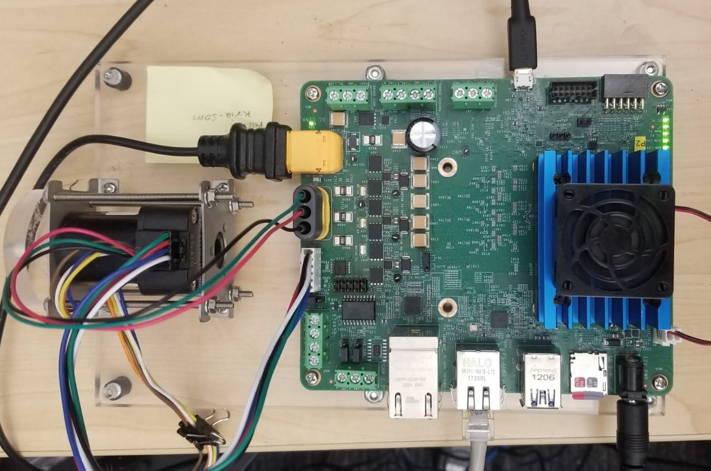

<table class="sphinxhide">
 <tr>
   <td align="center"><h1> Kria&trade; KD240 Drives Starter Kit <br>FOC Motor Control Application Tutorial</h1>
   </td>
 </tr>
 <tr>
 <td align="center"><h1>Setting up the Board and Application Deployment</h1>

 </td>
 </tr>
</table>

# Board Setup and Application Deployment

## Introduction

This document shows how to set up the board and run the Motor Control
Application.

## Hardware Requirements

* KD240 Drives Starter Kit

* KD240 Motor Accessory Kit

* KD240 Power Supply & Adapter (Included with KD240 Drives Starter Kit)
    * 12V AC Adapter for KD240 Starter Kit and 24V AC Adapter for Motor
      Accessory Kit

* USB-A to micro-B Cable (Included with KD240 Drives Starter Kit)

* 16GB MicroSD Card (Included with KD240 Drives Starter Kit)

* CAT6 Ethernet Cable

* Host Machine with Display

## Hardware Setup



* Connect USB cable to J4
* Connect Ethernet cable to J24
* Connect 12V power supply to J12
* Connect 24V power supply to J39
* Connect encoder header pins to J42
* Connect motor's AC power jack to J32

## Initial Setup

* Booting Linux

  Refer to the [KD240_linux_boot.pdf](
  https://www.xilinx.com/member/forms/download/design-license-xef.html?filename=KD240_linux_boot.pdf)
  document for instructions on how to flash the QSPI boot firmware and the
  Ubuntu SD card image and for booting to the Linux prompt.

* Upgrade flash-kernel and other packages on the system

  ```bash
  sudo apt update
  sudo apt upgrade
  ```

* Download and extract motor-ctrl app tarball
  [foc-motor-ctrl-app-kd240-ea-hotfix-1.tar.gz](
  https://www.xilinx.com/member/forms/download/design-license-xef.html?filename=foc-motor-ctrl-app-kd240-ea.tar.gz)
    * This contains the firmware and application debian packages
    * Copy the downloaded tarball to the board e.g. using scp over network or
      through USB drive
    * Extract the tarball; there will be three sub-folders for the individual
      application components

      ```bash
      tar xfv foc-motor-ctrl-app-kd240-ea-hotfix-1.tar.gz
      ls foc-motor-ctrl-app-kd240-ea-hotfix-1
         foc-motor-ctrl xlnx-firmware-kd240-motor-ctrl-qei
      ```

* Install the firmware

  ```bash
  sudo dpkg -i foc-motor-ctrl-app-kd240-ea-hotfix-1/xlnx-firmware-kd240-motor-ctrl-qei/*.deb
  ```

* Install the application and its dependencies

  ```bash
  # Install application runtime dependencies
  sudo apt install libiio-utils libiio0 python3-pybind11 python3-pip
  # Essentials to run Bokeh application
  sudo pip install bokeh==2.4.3
  # Install application
  sudo dpkg -i foc-motor-ctrl-app-kd240-ea-hotfix-1/foc-motor-ctrl/*.deb
  ```

## Run the motor control application:

* Load the firmware:

  * Show the list and status of available application firmware

    ```bash
    sudo xmutil listapps
    ```

  * Load the desired application firmware

    When there's already another accelerator/firmware loaded, unload it
    first, then load the kd240-foc-motor-ctrl firmware

    ```bash
    sudo xmutil unloadapp
    sudo xmutil loadapp kd240-motor-ctrl-qei
    ```

* Run the bokeh server:

  ```bash
  # Run the application to launch bokeh server for the dashboard
  export PATH=/opt/xilinx/motor-control/bin:${PATH}
  start_motor_dashboard
  # Enter the sudo password if required and note the ip address of the board
  ```

## On the host PC:

* Open &lt;ip&gt;:5006 in a web browser
* The system is set to OFF mode/state on starting the dashboard,
  observe LED DS10 is low
* The mode can be changed by using the Mode dropdown
* Speed setpoint range: [ 0  - 10000 ]
* Torque setpoint range: [ -2.5 - +2.5 ]
* Open loop ranges: [ Vd ( 0 - 24V) , Vq ( 0 - 24V) ]
* When transitioning between modes, use the OFF mode/state [ ex speed → OFF →
  torque → OFF → openloop ]
* On system fault, LED DS10 is low. To clear system faults transition to OFF
  mode and click on the Clear Faults button. Now set the correct parameters and
  transition to new test mode ( speed | openloop | torque )
* For help on setting up static IP, see [Setting up a private network](
  https://github.com/Xilinx/vck190-base-trd/blob/2022.1/docs/source/run/run-dashboard.rst#setting-up-a-private-network)

Note: User knowledge and experience is necessary to modulate voltages onto the
motor windings Vd, Vq. Higher values can cause the BLWR111D-24V-10000 motor to
spin at rated RPM (10000). Invalid voltages in the motor windings can cause
system faults. Kindly exercise necessary caution when spinning the motor
at higher speeds due to rotating or moving parts.

The image below shows a screenshot of the dashboard.


## Next Steps

* Go back to the [KD240 FOC Motor Control application start page](../foc_motor_control_landing)

<!---

Licensed under the Apache License, Version 2.0 (the "License"); you may not use
this file except in compliance with the License.

You may obtain a copy of the License at http://www.apache.org/licenses/LICENSE-2.0.

Unless required by applicable law or agreed to in writing, software distributed
under the License is distributed on an "AS IS" BASIS, WITHOUT WARRANTIES OR
CONDITIONS OF ANY KIND, either express or implied. See the License for the
specific language governing permissions and limitations under the License.

-->

<p class="sphinxhide" align="center">Copyright&copy; 2023 Advanced Micro Devices, Inc</p>
